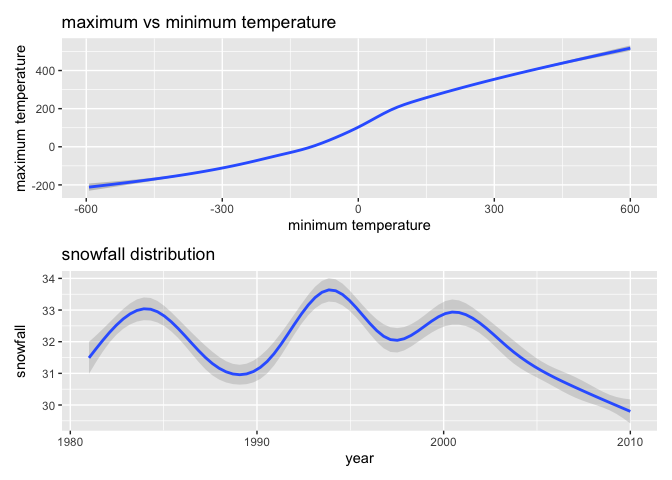

P8105\_hw3\_xz3032
================

## Load Package and data

``` r
library(tidyverse)
```

    ## ── Attaching packages ─────────────────────────────────────────────────────────────────────────────────── tidyverse 1.3.0 ──

    ## ✓ ggplot2 3.3.2     ✓ purrr   0.3.4
    ## ✓ tibble  3.0.3     ✓ dplyr   1.0.2
    ## ✓ tidyr   1.1.2     ✓ stringr 1.4.0
    ## ✓ readr   1.3.1     ✓ forcats 0.5.0

    ## ── Conflicts ────────────────────────────────────────────────────────────────────────────────────── tidyverse_conflicts() ──
    ## x dplyr::filter() masks stats::filter()
    ## x dplyr::lag()    masks stats::lag()

``` r
library(ggridges)
```

## Problem 1

Load Data

``` r
library(p8105.datasets)
data("instacart")
```

How many aisles? and which are most items ordered from?

``` r
instacart %>%
  count(aisle) %>%
  arrange(desc(n))
```

    ## # A tibble: 134 x 2
    ##    aisle                              n
    ##    <chr>                          <int>
    ##  1 fresh vegetables              150609
    ##  2 fresh fruits                  150473
    ##  3 packaged vegetables fruits     78493
    ##  4 yogurt                         55240
    ##  5 packaged cheese                41699
    ##  6 water seltzer sparkling water  36617
    ##  7 milk                           32644
    ##  8 chips pretzels                 31269
    ##  9 soy lactosefree                26240
    ## 10 bread                          23635
    ## # … with 124 more rows

Make a plot that shows the number of items ordered in each aisle,
limiting this to aisles with more than 10000 items ordered.

``` r
instacart %>%
  count(aisle) %>%
  filter(n > 10000) %>%
  mutate(
    aisle = as.factor(aisle),
    aisle = fct_reorder(aisle, n)
  ) %>%
  ggplot(aes(x = aisle, y = n)) + geom_point() +
  theme(axis.text.x = element_text(angle = 90, vjust = 0.5, hjust = 1))
```

<!-- -->

Make a table showing the three most popular items in each of the aisles
“baking ingredients”, “dog food care”, and “packaged vegetables
fruits”. Include the number of times each item is ordered in your
table.

``` r
instacart %>%
  filter(aisle %in% c("baking ingredients", "dog food care", "packaged vegetables fruits")) %>%
  group_by(aisle) %>%
  count(product_name) %>%
  mutate(rank = min_rank(desc(n))) %>%
  filter(rank < 4) %>%
  arrange(rank) %>%
  knitr::kable()
```

| aisle                      | product\_name                                 |    n | rank |
| :------------------------- | :-------------------------------------------- | ---: | ---: |
| baking ingredients         | Light Brown Sugar                             |  499 |    1 |
| dog food care              | Snack Sticks Chicken & Rice Recipe Dog Treats |   30 |    1 |
| packaged vegetables fruits | Organic Baby Spinach                          | 9784 |    1 |
| baking ingredients         | Pure Baking Soda                              |  387 |    2 |
| dog food care              | Organix Chicken & Brown Rice Recipe           |   28 |    2 |
| packaged vegetables fruits | Organic Raspberries                           | 5546 |    2 |
| baking ingredients         | Cane Sugar                                    |  336 |    3 |
| dog food care              | Small Dog Biscuits                            |   26 |    3 |
| packaged vegetables fruits | Organic Blueberries                           | 4966 |    3 |

Make a table showing the mean hour of the day at which Pink Lady Apples
and Coffee Ice Cream are ordered on each day of the week.

``` r
instacart %>%
  filter(product_name %in% c("Pink Lady Apples", "Coffee Ice Cream")) %>%
  group_by(product_name, order_dow) %>%
  summarize(mean_hour = mean(order_hour_of_day)) %>%
  pivot_wider(
    names_from = order_dow,
    values_from = mean_hour
  )
```

    ## `summarise()` regrouping output by 'product_name' (override with `.groups` argument)

    ## # A tibble: 2 x 8
    ## # Groups:   product_name [2]
    ##   product_name       `0`   `1`   `2`   `3`   `4`   `5`   `6`
    ##   <chr>            <dbl> <dbl> <dbl> <dbl> <dbl> <dbl> <dbl>
    ## 1 Coffee Ice Cream  13.8  14.3  15.4  15.3  15.2  12.3  13.8
    ## 2 Pink Lady Apples  13.4  11.4  11.7  14.2  11.6  12.8  11.9

## Problem 2

Load, tidy, and otherwise wrangle the data. include a weekday vs weekend
variable; and encode data with reasonable variable classes. Describe the
resulting dataset (e.g. what variables exist, how many observations,
etc).

``` r
accel_df = read_csv("./data/accel_data.csv")
```

    ## Parsed with column specification:
    ## cols(
    ##   .default = col_double(),
    ##   day = col_character()
    ## )

    ## See spec(...) for full column specifications.

``` r
accel_df2 = accel_df %>%
  pivot_longer(
    activity.1:activity.1440,
    names_to = "mintes_in_the_d",
    values_to = "activity_count"
  ) %>%
  mutate(
    weekday = case_when(
      day %in% c("Monday", "Tuesday", "Wednesday", "Thursday", "Friday") ~ "YES",
      day %in% c("Saturday", "Sunday") ~ "NO",
      TRUE ~ ""
  )) %>%
  mutate(
    day = as.factor(day),
    day = factor(day, levels = c("Sunday", "Monday", "Tuesday", "Wednesday", "Thursday", "Friday", "Saturday"))
  )
```

Short Description: The dataset is about a CHF patients’ daily “activity
count” data. Data were collected each minute of a 24-hour day starting
at midnight for 5 weeks, it contains 1443 variables, and the dataset has
a total of 1440\*35 observations.

Aggregate accross minutes to create a total activity variable for each
day, and create a table showing these totals. Are any trends apparent?

``` r
accel_df2 %>%
  group_by(week, day) %>%
  summarise(total_daily_activity = sum(activity_count)) %>%
  knitr::kable()
```

    ## `summarise()` regrouping output by 'week' (override with `.groups` argument)

| week | day       | total\_daily\_activity |
| ---: | :-------- | ---------------------: |
|    1 | Sunday    |              631105.00 |
|    1 | Monday    |               78828.07 |
|    1 | Tuesday   |              307094.24 |
|    1 | Wednesday |              340115.01 |
|    1 | Thursday  |              355923.64 |
|    1 | Friday    |              480542.62 |
|    1 | Saturday  |              376254.00 |
|    2 | Sunday    |              422018.00 |
|    2 | Monday    |              295431.00 |
|    2 | Tuesday   |              423245.00 |
|    2 | Wednesday |              440962.00 |
|    2 | Thursday  |              474048.00 |
|    2 | Friday    |              568839.00 |
|    2 | Saturday  |              607175.00 |
|    3 | Sunday    |              467052.00 |
|    3 | Monday    |              685910.00 |
|    3 | Tuesday   |              381507.00 |
|    3 | Wednesday |              468869.00 |
|    3 | Thursday  |              371230.00 |
|    3 | Friday    |              467420.00 |
|    3 | Saturday  |              382928.00 |
|    4 | Sunday    |              260617.00 |
|    4 | Monday    |              409450.00 |
|    4 | Tuesday   |              319568.00 |
|    4 | Wednesday |              434460.00 |
|    4 | Thursday  |              340291.00 |
|    4 | Friday    |              154049.00 |
|    4 | Saturday  |                1440.00 |
|    5 | Sunday    |              138421.00 |
|    5 | Monday    |              389080.00 |
|    5 | Tuesday   |              367824.00 |
|    5 | Wednesday |              445366.00 |
|    5 | Thursday  |              549658.00 |
|    5 | Friday    |              620860.00 |
|    5 | Saturday  |                1440.00 |

Accelerometer data allows the inspection activity over the course of the
day. Make a single-panel plot that shows the 24-hour activity time
courses for each day and use color to indicate day of the week. Describe
in words any patterns or conclusions you can make based on this graph.

``` r
accel_df2 %>%
  ggplot(aes(x = mintes_in_the_d, y = activity_count, color = day)) + geom_point(alpha = 0.5) + geom_line(alpha = 0.5) + labs(x = "mintes of day", y = "activity count", title = "activity acount per minute over 5 week")
```

<!-- --> The
plot is not smooth and steady, the patient’s activity is often intense
for a period of time and then followed by a period of low-intense
activity. There are some outliers which the activity count in a minutes
is over 7000.

## Problem

Load data set

``` r
library(p8105.datasets)
data("ny_noaa")
```

Do some data cleaning. Create separate variables for year, month, and
day.

``` r
noaa_df = ny_noaa %>% 
  separate(date, into = c("year", "month", "day"), convert = TRUE) %>%
  mutate(
  tmax = as.numeric(tmax), 
  tmin = as.numeric(tmin),
  prcp = prcp)
```

snowfall are given in reasonable units. For snowfall, what are the most
commonly observed values? Why? (0, most of days have no snow)

``` r
noaa_df %>%
  drop_na(snow) %>%
  count(snow) %>%
  arrange(desc(n))
```

    ## # A tibble: 281 x 2
    ##     snow       n
    ##    <int>   <int>
    ##  1     0 2008508
    ##  2    25   31022
    ##  3    13   23095
    ##  4    51   18274
    ##  5    76   10173
    ##  6     8    9962
    ##  7     5    9748
    ##  8    38    9197
    ##  9     3    8790
    ## 10   102    6552
    ## # … with 271 more rows

Make a two-panel plot showing the average max temperature in January and
in July in each station across years. Is there any observable /
interpretable structure? Any outliers?

``` r
noaa_df %>%
  filter(month == 3 & 7) %>%
  group_by(id, year, month) %>%
  summarize(mean_tmax = mean(tmax, na.rm = TRUE)) %>%
  ggplot(aes(x = year, y = mean_tmax, group = id, color = id)) + geom_point(alpha = 0.5) + labs(x = "year", y = "average maximum temperature", title = "average max temperature in Jan and Jul across year each station") + theme(legend.position = "none")
```

    ## `summarise()` regrouping output by 'id', 'year' (override with `.groups` argument)

    ## Warning: Removed 2902 rows containing missing values (geom_point).

<!-- -->
Average maximum temperature tend to follow a z shape patten, it flatuate
across years but mostly stay in a range between 0-125

Make a two-panel plot showing (i) tmax vs tmin for the full dataset
(note that a scatterplot may not be the best option); and (ii) make a
plot showing the distribution of snowfall values greater than 0 and less
than 100 separately by year.

``` r
library(patchwork)
plot1 = noaa_df %>%
  ggplot(aes(x = tmin, y = tmax)) + geom_smooth(alpha = 0.5) + labs(x = "minimum temperature", y = "maximum temperature", title = "maximum vs minimum temperature") + theme(legend.position = "none")

plot2 = noaa_df %>% 
  filter(snow > 0 & snow < 100 ) %>%
  ggplot(aes(x = year, y = snow), color = year) + geom_smooth(alpha = 0.3) + labs(x = "year", y = "snowfall", title = "snowfall distribution") + theme(legend.position = "none")

plot1 / plot2
```

    ## `geom_smooth()` using method = 'gam' and formula 'y ~ s(x, bs = "cs")'

    ## Warning: Removed 1136276 rows containing non-finite values (stat_smooth).

    ## `geom_smooth()` using method = 'gam' and formula 'y ~ s(x, bs = "cs")'

<!-- -->
